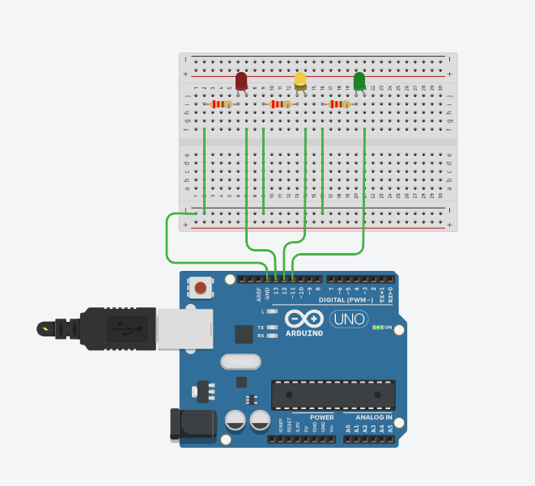

# arduino-traffic-light
Traffic light simulation using 3 LEDs
# Arduino Traffic Light Simulation

## Description
A traffic light simulation using 3 LEDs (red, yellow, green)
built with Arduino Uno. LEDs cycle through green, yellow, 
and red phases automatically like a real traffic light.

## Components Used
- Arduino Uno
- 1 Red LED
- 1 Yellow LED
- 1 Green LED
- 3 x 220Ω resistors
- Breadboard
- Jumper wires

## Circuit Connections
| Component  | Arduino Pin |
|------------|-------------|
| Red LED    | Pin 13      |
| Yellow LED | Pin 12      |
| Green LED  | Pin 11      |
| All GND    | GND rail    |

Each LED connected through 220Ω resistor to protect from overcurrent.

## How It Works
GREEN → ON for 5 seconds (Go signal)
YELLOW → ON for 2 seconds (Slow down signal)
RED → ON for 5 seconds (Stop signal)
Repeats forever automatically

## Code Concepts Used
- pinMode() — set pins as OUTPUT
- digitalWrite() — turn LEDs on and off
- delay() — control timing of each phase
- Functions — separate greenPhase(), yellowPhase(), redPhase()
- Serial Monitor — prints current phase in real time

## What I Learned
- Controlling multiple LEDs simultaneously
- Using functions to organize code cleanly
- Traffic light logic and timing
- Common ground connections on breadboard

## Serial Monitor Output
Traffic Light Ready
GREEN - Go
YELLOW - Slow Down
RED - Stop

## Future Improvements
- Add pedestrian walk signal LED
- Add button to trigger yellow phase manually
- Add countdown timer display

## Project Photo

## Author
Bhawan Singh
B.Tech Robotics — Semester 1